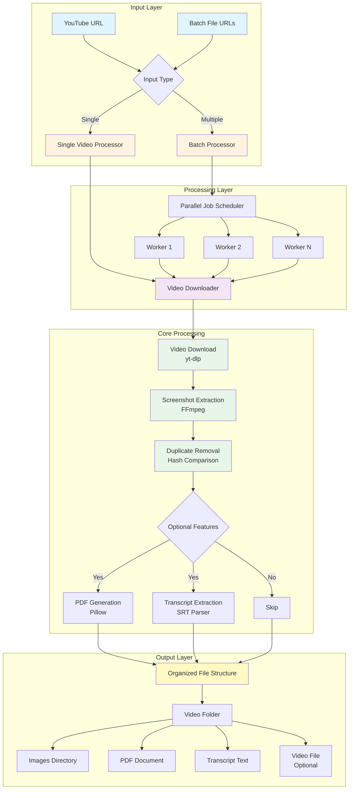
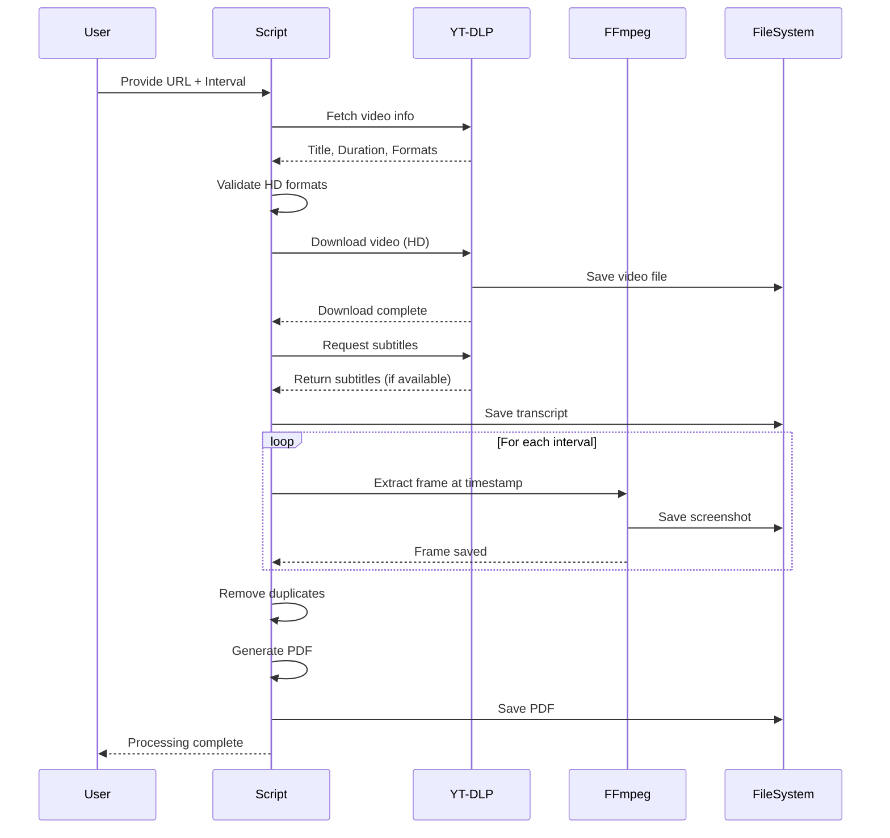
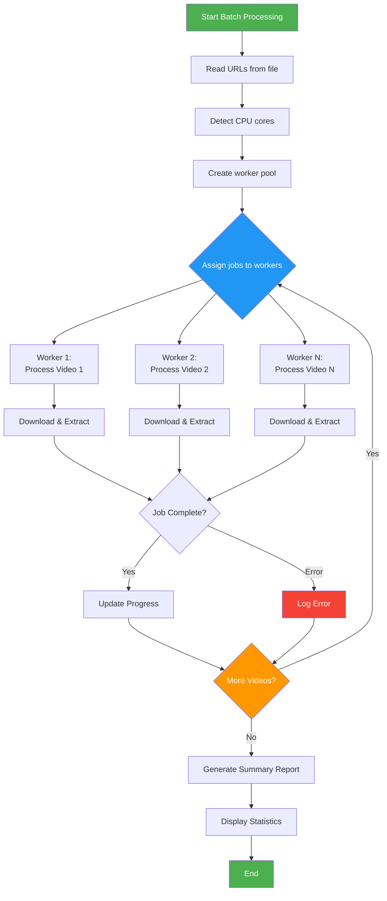
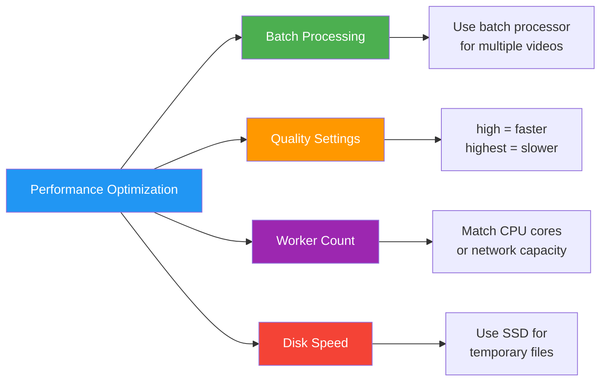

# 📸 YouTube Screenshot Capture Tool

[](https://www.python.org/downloads/)
[](LICENSE)
[](https://github.com/Yash-Kavaiya/YouTubeScreenshotCaptureTool)

A powerful and efficient tool for capturing high-quality screenshots from YouTube videos with advanced features including HD quality preservation, batch processing, PDF generation, and automatic transcript extraction.

## 📑 Table of Contents

- [Features](#-features)
- [System Architecture](#-system-architecture)
- [Workflow](#-workflow)
- [Installation](#-installation)
- [Usage](#-usage)
- [Command Reference](#-command-reference)
- [Examples](#-examples)
- [Output Structure](#-output-structure)
- [Troubleshooting](#-troubleshooting)
- [Performance](#-performance)
- [Contributing](#-contributing)
- [License](#-license)

## ✨ Features

### Core Capabilities

| Feature | Description | Single Video | Batch Processing |
|---------|-------------|--------------|------------------|
| 🎥 **HD Video Download** | Downloads videos in 1080p/720p quality | ✅ | ✅ |
| 📸 **Screenshot Extraction** | Captures frames at custom intervals | ✅ | ✅ |
| 🖼️ **Quality Options** | High JPEG or lossless PNG formats | ✅ | ✅ |
| 📄 **PDF Generation** | Creates high-resolution PDFs (configurable DPI) | ✅ | ✅ |
| 📝 **Transcript Download** | Extracts video subtitles/captions | ✅ | ✅ |
| 🗑️ **Duplicate Removal** | Automatically removes duplicate frames | ✅ | ✅ |
| ⚡ **Parallel Processing** | Processes multiple videos simultaneously | ❌ | ✅ |
| 📊 **Progress Tracking** | Real-time processing status | ✅ | ✅ |
| 🔄 **Multi-core Support** | Utilizes all available CPU cores | ❌ | ✅ |
| 💾 **Video Retention** | Optionally keeps downloaded videos | ✅ | ✅ |

### Advanced Features

- **Smart Quality Detection**: Automatically selects best available HD format
- **Cross-platform Compatibility**: Works on Linux, macOS, and Windows
- **Organized Output**: Creates structured folders with sanitized filenames
- **Flexible Configuration**: Extensive command-line options
- **Error Handling**: Robust error recovery and reporting
- **Format Support**: Multiple video and image format support

## 🏗️ System Architecture



## 🔄 Workflow

### Single Video Processing Workflow



### Batch Processing Workflow



## 📥 Installation

### Prerequisites

| Dependency | Ubuntu/Debian | macOS | Windows |
|------------|---------------|-------|---------|
| **Python 3.7+** | `sudo apt-get install python3 python3-pip` | `brew install python3` | [Download](https://python.org) |
| **FFmpeg** | `sudo apt-get install ffmpeg` | `brew install ffmpeg` | [Download](https://ffmpeg.org/download.html) |
| **yt-dlp** | `pip3 install yt-dlp` | `pip3 install yt-dlp` | `pip3 install yt-dlp` |
| **Pillow** | `pip3 install Pillow` | `pip3 install Pillow` | `pip3 install Pillow` |
| **NumPy** | `pip3 install numpy` | `pip3 install numpy` | `pip3 install numpy` |

### Quick Installation

#### Option 1: Automated Setup (Linux/macOS)

```bash
# Clone repository
git clone https://github.com/Yash-Kavaiya/YouTubeScreenshotCaptureTool.git
cd YouTubeScreenshotCaptureTool

# Install Python dependencies
pip3 install yt-dlp Pillow numpy

# Make scripts executable
chmod +x youtube_screenshots.py youtube_batch_processor.py ytscreenshot.sh

# Add to PATH (optional)
echo 'export PATH="$(pwd):$PATH"' >> ~/.bashrc
source ~/.bashrc
```

#### Option 2: Manual Setup (All Platforms)

```bash
# Install Python dependencies
pip3 install yt-dlp Pillow numpy

# Download scripts
# Save youtube_screenshots.py and youtube_batch_processor.py
```

### Verification

```bash
# Check installations
python3 --version
ffmpeg -version
yt-dlp --version

# Test the tool
python3 youtube_screenshots.py --help
```

## 🚀 Usage

### Single Video Processing

#### Basic Usage

```bash
# Default quality (high JPEG)
python3 youtube_screenshots.py "https://www.youtube.com/watch?v=VIDEO_ID" 5

# Maximum quality (lossless PNG)
python3 youtube_screenshots.py "https://www.youtube.com/watch?v=VIDEO_ID" 5 --quality highest

# With custom PDF DPI
python3 youtube_screenshots.py "URL" 5 --pdf-dpi 600
```

#### Advanced Options

```bash
# Keep downloaded video
python3 youtube_screenshots.py "URL" 5 --keep-video

# Custom output directory
python3 youtube_screenshots.py "URL" 5 --output-dir /path/to/output

# Skip PDF generation
python3 youtube_screenshots.py "URL" 5 --no-pdf

# Skip transcript download
python3 youtube_screenshots.py "URL" 5 --no-transcript

# Disable duplicate removal
python3 youtube_screenshots.py "URL" 5 --no-duplicate-removal
```

### Batch Processing

#### Using URL File

Create a `urls.txt` file:
```text
https://www.youtube.com/watch?v=video1
https://www.youtube.com/watch?v=video2
# Comments are ignored
https://www.youtube.com/watch?v=video3
```

#### Process Batch

```bash
# Basic batch processing
python3 youtube_batch_processor.py --batch urls.txt --interval 10

# With custom workers
python3 youtube_batch_processor.py --batch urls.txt --interval 10 --workers 4

# High quality batch processing
python3 youtube_batch_processor.py --batch urls.txt --interval 5 --quality highest --pdf-dpi 600
```

#### Using Bash Wrapper

```bash
# Single video
./ytscreenshot.sh --url "https://youtube.com/watch?v=VIDEO_ID" --interval 10

# Batch processing
./ytscreenshot.sh --batch urls.txt --interval 10 --quality highest --workers 8
```

## 📚 Command Reference

### youtube_screenshots.py (Single Video Processor)

| Option | Type | Default | Description |
|--------|------|---------|-------------|
| `url` | Positional | Required | YouTube video URL |
| `interval` | Positional | Required | Screenshot interval in seconds |
| `--keep-video` | Flag | False | Keep downloaded video file |
| `--output-dir` | String | `.` | Output directory path |
| `--quality` | Choice | `highest` | Quality: `high` (JPEG) or `highest` (PNG) |
| `--pdf-dpi` | Integer | `600` | PDF resolution (DPI) |
| `--no-pdf` | Flag | False | Skip PDF generation |
| `--no-transcript` | Flag | False | Skip transcript download |
| `--no-duplicate-removal` | Flag | False | Keep duplicate screenshots |
| `--force-local-hd` | Flag | False | Force HD download and keep locally |
| `--debug-formats` | Flag | False | Show all available video formats |

### youtube_batch_processor.py (Batch Processor)

| Option | Type | Default | Description |
|--------|------|---------|-------------|
| `--url` | String | - | Single video URL (exclusive with --batch) |
| `--batch` | String | - | Path to file with URLs (exclusive with --url) |
| `--interval` | Integer | Required | Screenshot interval in seconds |
| `--output-dir` | String | `.` | Base output directory |
| `--quality` | Choice | `high` | Quality: `high` or `highest` |
| `--pdf-dpi` | Integer | `300` | PDF resolution |
| `--workers` | Integer | CPU count | Number of parallel workers |
| `--keep-video` | Flag | False | Keep video files |
| `--no-transcript` | Flag | False | Skip transcripts |
| `--no-pdf` | Flag | False | Skip PDF generation |

### ytscreenshot.sh (Bash Wrapper)

Supports all options from batch processor with enhanced shell features:
- Automatic dependency checking
- Color-coded output
- Progress visualization
- Error handling

## 💡 Examples

### Example 1: Basic Screenshot Extraction

```bash
python3 youtube_screenshots.py "https://www.youtube.com/watch?v=dQw4w9WgXcQ" 10
```

**Output:**
```
video_title/
├── images/
│   ├── video_title_0000s.jpg
│   ├── video_title_0010s.jpg
│   ├── video_title_0020s.jpg
│   └── ...
├── video_title_HD.pdf
└── video_title_transcript.txt
```

### Example 2: High-Quality Screenshots with Custom Settings

```bash
python3 youtube_screenshots.py \
  "https://www.youtube.com/watch?v=VIDEO_ID" \
  5 \
  --quality highest \
  --pdf-dpi 600 \
  --keep-video
```

### Example 3: Batch Processing Multiple Videos

```bash
# Create URLs file
cat > videos.txt << EOF
https://www.youtube.com/watch?v=video1
https://www.youtube.com/watch?v=video2
https://www.youtube.com/watch?v=video3
EOF

# Process all videos
python3 youtube_batch_processor.py \
  --batch videos.txt \
  --interval 10 \
  --quality highest \
  --workers 4
```

### Example 4: Using Bash Wrapper

```bash
# Process with automatic dependency checking
./ytscreenshot.sh \
  --batch urls.txt \
  --interval 15 \
  --quality highest \
  --pdf-dpi 600 \
  --workers 8
```

## 📂 Output Structure

```
Output_Directory/
│
├── Video_Title_1/
│   ├── images/
│   │   ├── Video_Title_1_0000s.jpg     # Screenshot at 0s
│   │   ├── Video_Title_1_0005s.jpg     # Screenshot at 5s
│   │   ├── Video_Title_1_0010s.jpg     # Screenshot at 10s
│   │   └── ...
│   ├── Video_Title_1_HD.pdf            # High-resolution PDF
│   ├── Video_Title_1_transcript.txt    # Video transcript
│   └── Video_Title_1.mp4               # Original video (if --keep-video)
│
├── Video_Title_2/
│   ├── images/
│   │   └── ...
│   ├── Video_Title_2_HD.pdf
│   └── Video_Title_2_transcript.txt
│
└── ...
```

### File Naming Convention

| Component | Format | Example |
|-----------|--------|---------|
| **Folder Name** | Sanitized video title | `My_Awesome_Video` |
| **Screenshot** | `{title}_{time}s.{ext}` | `My_Awesome_Video_0015s.jpg` |
| **PDF** | `{title}_HD.pdf` | `My_Awesome_Video_HD.pdf` |
| **Transcript** | `{title}_transcript.txt` | `My_Awesome_Video_transcript.txt` |
| **Video** | `{title}.mp4` | `My_Awesome_Video.mp4` |

## 🔧 Troubleshooting

### Common Issues and Solutions

| Issue | Cause | Solution |
|-------|-------|----------|
| **"yt-dlp not found"** | yt-dlp not installed or not in PATH | `pip3 install --upgrade yt-dlp` |
| **"ffmpeg not found"** | FFmpeg not installed | Install via package manager (see [Installation](#-installation)) |
| **"Permission denied"** | Scripts not executable | `chmod +x *.py *.sh` |
| **Low quality screenshots** | Video not available in HD | Check `--debug-formats` for available qualities |
| **Age-restricted videos** | Authentication required | Use cookies: `yt-dlp --cookies-from-browser chrome` |
| **Network errors** | Connection issues or geo-blocking | Check internet connection, try VPN |
| **Memory errors** | Large batch processing | Reduce `--workers` count |
| **Duplicate removal slow** | Many screenshots | Use `--no-duplicate-removal` flag |

### Debug Mode

```bash
# Show all available video formats
python3 youtube_screenshots.py "URL" 5 --debug-formats

# Check dependencies
python3 youtube_batch_processor.py --help
```

### Log Files

Batch processor provides detailed logging:
```
[12:34:56] INFO: [Job 1] Fetching info for: https://youtube.com/...
[12:34:58] INFO: [Job 1] Downloading: Video Title
[12:35:30] INFO: [Job 1] Extracting screenshots...
[12:36:00] INFO: [Job 1] ✓ Completed: Video Title
```

## ⚡ Performance

### Benchmarks

| Configuration | Single Video | 10 Videos (Batch) | Speedup |
|---------------|--------------|-------------------|---------|
| **Sequential** | ~2 min | ~20 min | 1x |
| **2 Workers** | ~2 min | ~11 min | 1.8x |
| **4 Workers** | ~2 min | ~6 min | 3.3x |
| **8 Workers** | ~2 min | ~4 min | 5.0x |

*Note: Times vary based on video length, internet speed, and system performance.*

### Performance Tips



### Optimization Recommendations

1. **For Speed**: Use `--quality high` (JPEG) and `--no-pdf`
2. **For Quality**: Use `--quality highest` (PNG) and `--pdf-dpi 600`
3. **For Batch Jobs**: Set `--workers` to match CPU cores
4. **For Large Videos**: Increase interval to reduce screenshot count
5. **For Storage**: Use `--no-duplicate-removal` (faster but more files)

## 🤝 Contributing

Contributions are welcome! Please feel free to submit a Pull Request. For major changes, please open an issue first to discuss what you would like to change.

### Development Setup

```bash
git clone https://github.com/Yash-Kavaiya/YouTubeScreenshotCaptureTool.git
cd YouTubeScreenshotCaptureTool
pip3 install -r requirements.txt
```

### Running Tests

```bash
# Test single video processing
python3 youtube_screenshots.py --help

# Test batch processing
python3 youtube_batch_processor.py --help
```

## 📄 License

This project is free to use and modify for personal and commercial purposes.

## 🙏 Acknowledgments

- **yt-dlp**: YouTube video downloading
- **FFmpeg**: Video processing and screenshot extraction
- **Pillow**: Image processing and PDF generation
- **NumPy**: Array operations for image comparison

## 📞 Support

For issues, questions, or suggestions:
- Open an [Issue](https://github.com/Yash-Kavaiya/YouTubeScreenshotCaptureTool/issues)
- Check existing documentation
- Review [Troubleshooting](#-troubleshooting) section

---

**Made with ❤️ for efficient video screenshot capture**